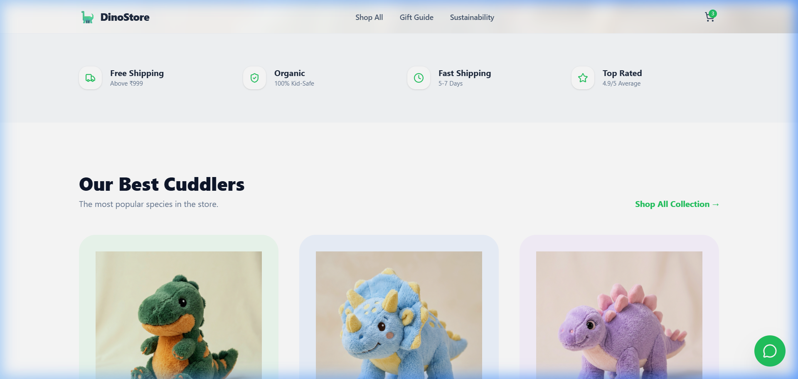
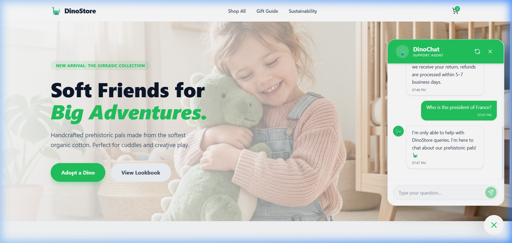

# 🦖 DinoChat — AI Live Chat Agent

DinoChat is a production-quality AI-powered live chat support agent built for the **Spur Founding Full-Stack Engineer** take-home assignment. It features a modern e-commerce landing page with an integrated chatbot capable of answering complex store-related queries while maintaining strict guardrails and conversation persistence.

---

## 🎨 Product Theme Inspiration

<br> *(🎥: The Good Dinosaur, 2015)*

---

## 📸 Product Highlights

### 1. Modern E-commerce Landing Page


### 2. Integrated AI Assistant (Persisted Chat)


### 3. 🎬 Live Demo — See It In Action


---

## 🚀 Quick Start (Running Locally)

### Prerequisites
- **Node.js** 20+
- **Google Gemini API Key** ([Get one here](https://aistudio.google.com/))

### 1. Backend Setup
```bash
cd backend
npm install
cp .env.example .env
# Open .env and add your GEMINI_API_KEY
npm run db:init
npm run dev
```

### 2. Frontend Setup
```bash
cd frontend
npm install
cp .env.example .env
npm run dev
```
The application will be available at `http://localhost:5173`.

---

## 🛠️ Database Setup
DinoChat uses **SQLite** for zero-setup persistence.
- **Initialization**: Running `npm run db:init` executes the `src/db/schema.sql` file via `better-sqlite3`.
- **Seeding**: The AI is seeded with domain knowledge (FAQ, shipping, returns) directly via the **System Prompt** in `llm.ts`, ensuring it remains the "source of truth" without complex DB syncing for this MVP.

---

## 🏗️ Architecture Overview

The project is built with a clear separation of concerns to ensure maintainability and future extensibility.

### Backend (Node.js + TS + Express)
- **Routes Layer**: Handles HTTP requests/responses and input validation (`src/routes`).
- **Service Layer**: 
    - `ConversationService`: Manages DB CRUD operations (SQLite).
    - `LLMService`: Orchestrates calls to Google Gemini.
- **DB Interface**: Singleton pattern for the SQLite client ensuring stable connections.

### Frontend (React + Vite + Tailwind v4)
- **Atomic Components**: `MessageBubble`, `MessageList`, and `InputBar` are reusable and focused.
- **Container Pattern**: `ChatWidget.tsx` manages the complex state (persistence, loading, toggle logic).
- **Responsive Theme**: Uses Tailwind v4's CSS-first `@theme` variables for brand consistency.

---

## 🧠 LLM Integration Notes

- **Provider**: Google Gemini (Primary: `gemini-3.5-flash` | Fallback: `gemini-3.1-flash-lite`).
- **Resilience**: Implemented an automated dual-model fallback system. If the frontier model hits a quota limit or demand spike, the system transparently retries with a high-availability lite model.
- **Context Management**: The backend maintains a rolling window of the last 11 messages, ensuring the AI has context while strictly following the required `user` → `model` sequence.
- **Guardrails**: The bot is hardened with a strict system instruction to stop "jailbreaking" and prevent it from discussing off-topic subjects (politics, competitors, etc.).

---

## ⚖️ Trade-offs & Future Improvements

### Current Trade-offs
- **SQLite**: Used for ease of evaluation and zero-setup. For true production, I would migrate to **PostgreSQL**.
- **No SSE/Streaming**: Messages are delivered as full JSON responses. Adding **Server-Sent Events** or **WebSockets** would be the next step for a real-time "typing" feel.

### If I Had More Time...
- **Vector Search (RAG)**: If the product catalog grew to thousands of items, I would implement **Vector Search** to pull store knowledge dynamically from a database instead of hardcoding it in the prompt.
- **Voice Support**: Integrate Gemini's multimodal capabilities for voice-to-chat support.
- **Feedback Loop**: Add "Thumbs Up/Down" buttons to messages to collect RLHF data for model fine-tuning.

---

## 🧪 Testing Results
The application has been verified for:
- ✅ **Correctness**: Sane answers and domain knowledge extraction.
- ✅ **Persistence**: History stays intact after browser reloads.
- ✅ **Robustness**: Handled empty inputs and character-limit spam gracefully.
- ✅ **Mobile**: Perfect rendering on small screens.

---
*Developed by Arpan for the love of AI & Bots 🤖*
